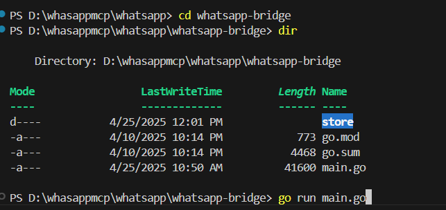
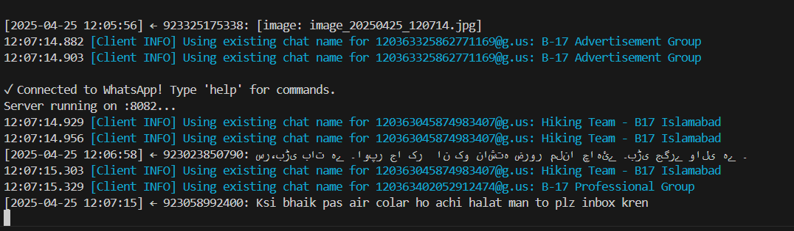

Objective: Run MCP Server and send message and search contact by web page, you can do this operation by usinh Chat Agent , example is everwhere like lharries repository which is listed below.

My objective is to run whatsapp operation using personal account by webpage

There is WhatsApp folder that contains Bridge and Server
There are open files send_message.html and test_search.html

Step 1 : Follow the instruction on https://github.com/lharries/whatsapp-mcp?tab=readme-ov-file
and install are Prerequisites

Step 2: The file mcp.json in root of project tells the visual studio code that MCP Server is hosted here.

Step 3: Run the main go filego run main.go
        it runs the project and download your data in SQL lite database

Step 4: Now run the python http server in order to serve html files python3 -m http.server 8080

PS D:\whasappmcp>  python3 -m http.server 8080

Serving HTTP on :: port 8080 (http://[::]:8080/) ...
::1 - - [25/Apr/2025 11:54:00] "GET / HTTP/1.1" 200 -
::1 - - [25/Apr/2025 11:54:00] code 404, message File not found
::1 - - [25/Apr/2025 11:54:00] "GET /favicon.ico HTTP/1.1" 404 -
::1 - - [25/Apr/2025 11:54:08] "GET /send_message.html HTTP/1.1" 200 -
::1 - - [25/Apr/2025 11:55:23] "GET /test_search.html HTTP/1.1" 200 -

Step 5: Browse the html page and do action you can also use VS code agent to talk to MCP server by Chat Agent in sidebar

        